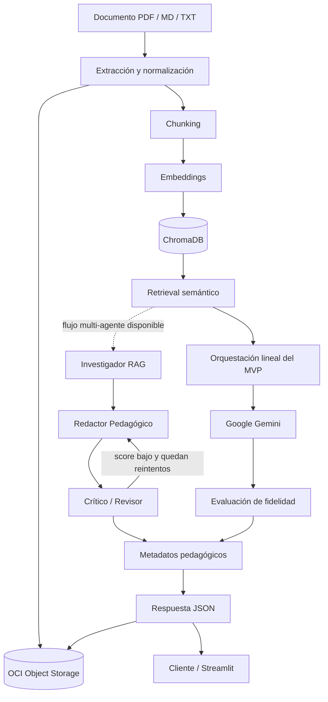

# NuevaMente

Sistema inteligente de adaptación y generación de contenido educativo desarrollado para el Hackathon ONE G10 de Oracle Next Education y Alura.

NuevaMente transforma documentación técnica en materiales didácticos adaptados al perfil de quien aprende, el formato deseado, el sector de aplicación y el nivel de detalle. El proyecto combina recuperación semántica (RAG), Google Gemini, evaluación de fidelidad y persistencia en OCI Object Storage.

## Problema que resuelve

La documentación técnica suele asumir conocimientos previos y presentar el mismo contenido a públicos con necesidades distintas. NuevaMente permite convertir una fuente técnica en tutoriales, flashcards, cuestionarios, resúmenes ejecutivos o guiones de clase, manteniendo el contenido anclado al documento original.

El caso de uso principal pertenece al sector **EdTech**, con contextualización adicional para Fintech, Salud, Ecommerce o un dominio general.

## Funcionalidades

- Extracción y normalización de documentos PDF, Markdown y TXT.
- Segmentación, embeddings e indexación local con ChromaDB.
- Recuperación de contexto relevante antes de generar contenido.
- Adaptación mediante Google Gemini con salida estructurada.
- Flujo multi-agente experimental con Investigador RAG, Redactor Pedagógico y Crítico/Revisor.
- Cinco formatos pedagógicos: Tutorial, Flashcards, Quiz, Resumen Ejecutivo y Guion de Clase.
- Evaluación de fidelidad y claridad pedagógica.
- Metadatos de aprendizaje y estimación del tiempo de estudio.
- Persistencia de documentos y resultados en OCI Object Storage.
- API REST con FastAPI y contratos validados mediante Pydantic v2.
- Interfaz Streamlit para cargar documentos y configurar la adaptación.
- Despliegue de FastAPI y Streamlit en OCI Compute mediante contenedores Docker.

## Arquitectura



El backend mantiene separadas las capas HTTP, los contratos y la lógica de negocio:

```text
endpoint -> servicio de adaptación -> RAG / Gemini / evaluación / metadatos
                                \-> servicio de almacenamiento -> OCI
```

El flujo lineal es el recorrido principal del endpoint del MVP. El servicio multi-agente implementado con LangGraph reutiliza retrieval, generación y evaluación para permitir ciclos de revisión controlados, pero todavía se ejecuta mediante un script de comparación y no está seleccionable desde el endpoint integral.

La descripción completa y los contratos de datos se encuentran en [`docs/ARCHITECTURE.md`](docs/ARCHITECTURE.md).

## Tecnologías principales

| Componente | Tecnología |
|---|---|
| API | FastAPI + Python 3.11+ |
| Interfaz | Streamlit |
| Validación | Pydantic v2 |
| LLM y embeddings | Google Gemini |
| Orquestación | LangChain (endpoint del MVP) + LangGraph (flujo experimental) |
| Base vectorial | ChromaDB |
| Persistencia | OCI Object Storage |
| Despliegue | OCI Compute + Docker Compose + Traefik |
| Secretos en OCI | OCI Vault + Instance Principal |
| Pruebas | Pytest |

### Estado actual de los componentes

| Componente | Estado |
|---|---|
| Backend FastAPI | Implementado: ingesta, RAG, generación, fidelidad, metadatos y persistencia OCI. |
| Pipeline lineal | Integrado en `POST /api/v1/adaptar-contenido`. |
| Flujo multi-agente | Implementado y probado mediante script; pendiente de exponer desde el endpoint. |
| Frontend Streamlit | Implementado y conectado a los endpoints de extracción y adaptación de FastAPI. |
| Despliegue OCI Compute | Implementado y validado: Streamlit público, FastAPI privado y persistencia real en Object Storage. |

## Estructura del repositorio

```text
backend/
├── app/
│   ├── api/v1/endpoints/   # Rutas HTTP
│   ├── core/               # Configuración global
│   ├── schemas/            # Contratos Pydantic
│   ├── services/           # Ingesta, RAG, Gemini y reglas de negocio
│   └── main.py             # Aplicación FastAPI
├── scripts/                # Utilidades y benchmarks
├── tests/                  # Pruebas automatizadas
├── .env.example            # Plantilla de configuración sin secretos
└── requirements.txt        # Dependencias fijadas
frontend/
├── components/              # Componentes de la interfaz Streamlit
├── services/                # Cliente HTTP para FastAPI
├── tests/                   # Pruebas del frontend
├── app.py                   # Punto de entrada de Streamlit
├── .env.example             # URL local de la API
└── requirements.txt         # Dependencias del frontend
deploy/oci/
├── compose.backend.yml      # Backend y frontend en redes Docker separadas
└── README.md                # Guía operativa de despliegue en OCI Compute
docs/
└── ARCHITECTURE.md         # Arquitectura y contratos oficiales
```

## Requisitos

- Python 3.11 o superior.
- Git.
- Docker y Docker Compose para reproducir el despliegue en contenedores.
- Una API key de Google Gemini para probar el pipeline real.
- Una cuenta de OCI con Object Storage para probar la persistencia real.

El modo mock permite probar el contrato de adaptación sin consumir Gemini ni escribir objetos en OCI.

## Instalación local

Clonar el repositorio y entrar al backend:

```powershell
git clone https://github.com/No-Country-simulation/nuevamente-g10-latam-equipo21.git
cd nuevamente-g10-latam-equipo21/backend
```

Crear y activar un entorno virtual:

```powershell
python -m venv .venv
.\.venv\Scripts\Activate.ps1
```

En Linux o macOS, la activación equivalente es:

```bash
source .venv/bin/activate
```

Instalar las dependencias:

```powershell
python -m pip install --upgrade pip
python -m pip install -r requirements.txt
```

Crear la configuración local a partir de la plantilla:

```powershell
Copy-Item .env.example .env
```

En Linux o macOS:

```bash
cp .env.example .env
```

El archivo `.env` contiene configuración local y secretos: **nunca debe agregarse a Git**.

### Instalación del frontend

En una segunda terminal, entrar a `frontend/`, crear otro entorno virtual e
instalar sus dependencias:

```powershell
cd ..\frontend
python -m venv .venv
.\.venv\Scripts\Activate.ps1
python -m pip install --upgrade pip
python -m pip install -r requirements.txt
Copy-Item .env.example .env
```

En Linux o macOS, utilizar `source .venv/bin/activate` y
`cp .env.example .env`. La plantilla configura el acceso local a FastAPI sin
incluir secretos.

## Configuración

Las variables disponibles se encuentran en [`backend/.env.example`](backend/.env.example).

### Aplicación

| Variable | Valor de ejemplo | Uso |
|---|---|---|
| `ENVIRONMENT` | `development` | Entorno de ejecución. |
| `API_V1_STR` | `/api/v1` | Prefijo de las rutas de la API. |
| `PROJECT_NAME` | `NuevaMente API` | Nombre expuesto por FastAPI. |
| `VERSION` | `0.1.0` | Versión informativa de la API. |
| `USE_MOCK_LLM` | `true` | Activa la respuesta mock sin llamadas externas. |
| `CORS_ORIGINS` | `["http://localhost:8501"]` | Orígenes autorizados para el frontend. |

### Gemini y RAG

| Variable | Valor de ejemplo | Uso |
|---|---|---|
| `GEMINI_API_KEY` | `tu_api_key_aqui` | Credencial de Gemini; obligatoria para el pipeline real. |
| `GEMINI_MODEL_NAME` | `gemini-3.8-flash` | Modelo generativo. |
| `GEMINI_EMBEDDING_MODEL_NAME` | `gemini-embedding-001` | Modelo de embeddings. |
| `GEMINI_TIMEOUT_SECONDS` | `30` | Tiempo máximo por llamada al proveedor. |
| `CHROMA_PERSIST_DIRECTORY` | `./chroma_db` | Directorio local de ChromaDB. |
| `RETRIEVAL_TOP_K` | `5` | Cantidad máxima de fragmentos recuperados. |
| `RETRIEVAL_SCORE_THRESHOLD` | `0.35` | Umbral mínimo de similitud. |
| `RETRIEVAL_MAX_CONTEXT_TOKENS` | `2000` | Límite del contexto ensamblado. |
| `FIDELITY_SCORE_THRESHOLD` | `0.7` | Umbral de fidelidad contra la fuente. |
| `MULTI_AGENT_MAX_ITERATIONS` | `3` | Máximo de iteraciones Redactor-Crítico del flujo multi-agente. |

### OCI Object Storage

| Variable | Valor de ejemplo | Uso |
|---|---|---|
| `OCI_AUTH_MODE` | `api_key` | Método de autenticación: `api_key` en local o `instance_principal` en OCI Compute. |
| `OCI_NAMESPACE` | `tu_namespace_oci_aqui` | Namespace de Object Storage. |
| `OCI_BUCKET_NAME` | `nuevamente-contenidos-educativos` | Bucket privado del proyecto. |
| `OCI_REGION` | `sa-saopaulo-1` | Región de OCI. |
| `OCI_USER_OCID` | valor local | Usuario técnico para autenticación por API key. |
| `OCI_TENANCY_OCID` | valor local | Tenancy de OCI. |
| `OCI_FINGERPRINT` | valor local | Fingerprint de la clave pública. |
| `OCI_KEY_FILE` | `~/.oci/oci_api_key.pem` | Ruta local a la clave privada. |
| `OCI_KEY_PASSPHRASE` | vacío | Passphrase, si la clave privada utiliza una. |

No compartas el archivo `.env`, `~/.oci/config`, claves `.pem` ni credenciales reales.

### Validación de configuración al iniciar

Cuando `USE_MOCK_LLM=false`, el backend valida la configuración del pipeline real al arrancar. Deben estar definidas como mínimo:

- `GEMINI_API_KEY`
- `OCI_NAMESPACE`

Si alguna falta, la aplicación no inicia y el mensaje de configuración identifica la variable ausente.

`OCI_AUTH_MODE` mantiene `instance_principal` como valor predeterminado para el despliegue en OCI Compute.

Para desarrollo local con credenciales de usuario:

```dotenv
USE_MOCK_LLM=false
GEMINI_API_KEY=tu_api_key
OCI_NAMESPACE=tu_namespace
OCI_AUTH_MODE=api_key
```

Para una VM de OCI Compute:

```dotenv
USE_MOCK_LLM=false
GEMINI_API_KEY=tu_api_key
OCI_NAMESPACE=tu_namespace
OCI_AUTH_MODE=instance_principal
```

En la VM no deben copiarse `OCI_USER_OCID`, `OCI_TENANCY_OCID`, `OCI_FINGERPRINT` ni claves privadas cuando se utiliza `instance_principal`.

## Configuración de OCI Object Storage

1. Seleccionar la región donde se ejecutará el proyecto; el entorno actual utiliza São Paulo (`sa-saopaulo-1`).
2. Crear un bucket **privado** llamado `nuevamente-contenidos-educativos` o definir otro nombre mediante `OCI_BUCKET_NAME`.
3. Crear un grupo IAM para el servicio y asignarle una política limitada al bucket requerido.
4. Crear un usuario técnico, agregarlo al grupo y registrar su clave pública de API.
5. Guardar la clave privada solamente en el equipo o instancia que ejecuta el backend.
6. En local, completar `OCI_AUTH_MODE=api_key` y las variables de la credencial dentro del `.env`.
7. En OCI Compute, utilizar `OCI_AUTH_MODE=instance_principal` y dejar vacías las variables de API key.
8. Verificar permisos de carga y lectura sin otorgar acceso a otros buckets.

Para despliegues sobre una instancia de OCI debe utilizarse la autenticación mediante principal de instancia, evitando claves de usuario almacenadas en el servidor.

NM-11 proporciona la carga del documento original y del paquete generado. Su adaptador ya está conectado al pipeline integral de NM-12.

Las fallas normales de persistencia en OCI no descartan el contenido generado: el endpoint conserva HTTP 200 y devuelve `almacenamiento_oci.status_upload="error"`.

Las fallas de autenticación o autorización contra OCI se consideran errores de configuración o credenciales y se devuelven al cliente como HTTP 502 con el código `OCI_AUTENTICACION_ERROR`, sin exponer credenciales ni detalles sensibles.

## Despliegue en OCI Compute

El despliegue validado ejecuta FastAPI y Streamlit como contenedores separados.
Traefik publica únicamente la interfaz, mientras que FastAPI permanece en una
red Docker interna. La VM utiliza Instance Principal para acceder a Object
Storage y recuperar desde OCI Vault la clave de Gemini sin versionarla.

La construcción de imágenes, configuración de Vault, inicio de servicios,
health checks y prueba end-to-end de persistencia están documentados en
[`deploy/oci/README.md`](deploy/oci/README.md).

## Ejecución

Los comandos del backend deben ejecutarse desde `backend/`, con su entorno virtual activo.

### Modo mock

Permite comprobar el contrato HTTP sin utilizar Gemini, ChromaDB ni OCI:

```dotenv
USE_MOCK_LLM=true
```

Después de iniciar la API, puede comprobarse el modo mock desde PowerShell:

```powershell
$body = @{
    documento_titulo = "Introducción a las redes VCN"
    documento_contenido = "Una Virtual Cloud Network es una red privada y configurable dentro de Oracle Cloud Infrastructure."
    perfil_destinatario = "Principiante"
    formato_salida = "Flashcards"
    nicho_sector = "General"
    nivel_detalle = "Didactico"
} | ConvertTo-Json

Invoke-RestMethod `
    -Method Post `
    -Uri "http://127.0.0.1:8000/api/v1/adaptar-contenido" `
    -ContentType "application/json" `
    -Body $body
```

### Pipeline real

Ejecuta recuperación, Gemini, evaluación, metadatos y persistencia en OCI:

```dotenv
USE_MOCK_LLM=false
GEMINI_API_KEY=tu_api_key
OCI_AUTH_MODE=api_key
OCI_NAMESPACE=tu_namespace
```

En el pipeline real también deben completarse las variables OCI restantes descritas en la sección de configuración. Dentro de OCI Compute debe utilizarse `OCI_AUTH_MODE=instance_principal` y no deben copiarse credenciales de usuario a la instancia.

Iniciar la API en modo desarrollo:

```powershell
python -m uvicorn app.main:app --reload
```

Servicios disponibles:

- API: <http://127.0.0.1:8000>
- Estado: <http://127.0.0.1:8000/api/v1/health>
- Swagger UI: <http://127.0.0.1:8000/api/v1/docs>
- Acceso corto a Swagger: <http://127.0.0.1:8000/docs>.
- OpenAPI: <http://127.0.0.1:8000/api/v1/openapi.json>

### Frontend Streamlit

Con FastAPI en ejecución, iniciar la interfaz desde `frontend/` y con el entorno
virtual del frontend activo:

```powershell
python -m streamlit run app.py
```

La interfaz queda disponible en <http://127.0.0.1:8501> y consume por defecto
la API en `http://127.0.0.1:8000/api/v1`. La variable `API_BASE_URL` de
`frontend/.env` permite utilizar otra dirección.

### Pruebas automatizadas

Desde `backend/`, con el entorno virtual del backend activo:

```powershell
python -m pytest tests -q
```

Desde `frontend/`, con el entorno virtual del frontend activo:

```powershell
python -m pytest tests -q
```

La prueba contra el bucket real es opt-in para evitar escrituras accidentales durante una ejecución normal:

```powershell
$env:RUN_OCI_INTEGRATION = "1"
python -m pytest tests/test_storage_oci_integration.py -v -s
Remove-Item Env:RUN_OCI_INTEGRATION
```

La política IAM del proyecto permite crear y leer objetos, pero no eliminarlos. Por ese motivo, el objeto pequeño generado por la prueba puede permanecer en el bucket y requerir limpieza manual desde una identidad administrativa.

## Uso de la API

### 1. Extraer texto de un documento

`POST /api/v1/documents/extract` recibe un archivo PDF, Markdown o TXT como `multipart/form-data`.

Ejemplo con `curl`:

```bash
curl -X POST "http://127.0.0.1:8000/api/v1/documents/extract" \
  -F "file=@documento.pdf"
```

La respuesta entrega el texto normalizado en `text` y los datos del archivo en `metadata`. Ese texto puede utilizarse como `documento_contenido` en la solicitud de adaptación.

### 2. Adaptar el contenido

`POST /api/v1/adaptar-contenido` recibe texto previamente extraído y los cuatro ejes de personalización.

Request de ejemplo:

```json
{
  "documento_titulo": "Introducción a las redes VCN",
  "documento_contenido": "Una Virtual Cloud Network es una red privada y configurable dentro de Oracle Cloud Infrastructure.",
  "perfil_destinatario": "Principiante",
  "formato_salida": "Flashcards",
  "nicho_sector": "General",
  "nivel_detalle": "Didactico"
}
```

Response de ejemplo:

```json
{
  "status": "exito",
  "metadatos": {
    "perfil_aplicado": "Principiante",
    "formato_generado": "Flashcards",
    "tiempo_estimado_estudio_minutos": 5,
    "conceptos_clave": ["VCN", "Subredes", "Internet Gateway"],
    "prerrequisitos": []
  },
  "contenido_adaptado": {
    "titulo": "Introducción a las redes VCN",
    "introduccion_contextualizada": "Estas tarjetas resumen los conceptos principales del documento.",
    "items": [
      {
        "frente": "¿Qué es una VCN?",
        "dorso": "Una red privada configurable dentro de OCI.",
        "pista_didactica": "Imagina una red aislada propia dentro de la nube."
      }
    ]
  },
  "evaluacion_calidad": {
    "anclaje_fuente_score": 0.95,
    "claridad_pedagogica": "Alta",
    "observaciones": "El contenido se encuentra respaldado por la fuente."
  },
  "almacenamiento_oci": {
    "bucket": "nuevamente-contenidos-educativos",
    "objeto_id": "contenido-introduccion-a-las-redes-vcn-principiante-flashcards-a1b2c3d4e5f6.json",
    "status_upload": "completado"
  }
}
```

Valores admitidos:

- `perfil_destinatario`: `Principiante`, `Desarrollador_Junior_SemiSenior`, `Lider_Tecnico_Arquitecto`, `Gestor_Ejecutivo_No_Tecnico`.
- `formato_salida`: `Tutorial`, `Flashcards`, `Quiz`, `Resumen_Ejecutivo`, `Guion_Clase`.
- `nicho_sector`: `Fintech`, `Salud`, `Ecommerce`, `General`.
- `nivel_detalle`: `Introductorio`, `Didactico`, `Tecnico_Profundo`.

> Con `USE_MOCK_LLM=true`, el endpoint devuelve datos de prueba respetando el contrato y no ejecuta servicios externos. Con `USE_MOCK_LLM=false`, utiliza el pipeline real y persiste el paquete generado mediante OCI Object Storage.

### Comportamiento ante errores

- Una entrada inválida devuelve HTTP 422 con `status: "error"` y el bloque `error` (`codigo`, `mensaje`).
- Un fallo del LLM o del vector store devuelve HTTP 502 sin exponer trazas ni credenciales.
- Un fallo de OCI no invalida el contenido generado: devuelve HTTP 200 con `almacenamiento_oci.status_upload: "error"`.
- Los errores quedan asociados a un identificador de petición en los logs del backend.

Ejemplo de entrada inválida:

```json
{
  "status": "error",
  "error": {
    "codigo": "ENTRADA_INVALIDA",
    "mensaje": "Campo 'perfil_destinatario': Input should be 'Principiante', 'Desarrollador_Junior_SemiSenior', 'Lider_Tecnico_Arquitecto' or 'Gestor_Ejecutivo_No_Tecnico'"
  }
}
```

## Seguridad

- No versionar `.env`, claves privadas, tokens ni archivos `.pem`.
- No incluir credenciales reales en capturas, issues, logs o pull requests.
- Utilizar usuarios técnicos y permisos de mínimo privilegio en OCI.
- Rotar inmediatamente cualquier credencial que haya sido expuesta.

## Historial de tickets integrados

| Fecha de integración (UTC) | Ticket | Entrega incorporada | Responsable de implementación | Pull request | Responsable de la review aprobatoria |
|---|---|---|---|---|---|
| 23 sep 2026 | NM-03 | Estructura inicial del backend FastAPI, configuración y documentación base. | Leandro Melchiori | [#29](https://github.com/No-Country-simulation/nuevamente-g10-latam-equipo21/pull/29) | Bianca Zorio |
| 24 sep 2026 | NM-05 | Chunking, embeddings e indexación en ChromaDB. | Ever Ayala | [#35](https://github.com/No-Country-simulation/nuevamente-g10-latam-equipo21/pull/35) | Leandro Melchiori |
| 24 y 29 sep 2026 | NM-04 | Extracción y normalización de documentos PDF, Markdown y TXT, seguida de su corrección final. | Julio Diaz | [#36](https://github.com/No-Country-simulation/nuevamente-g10-latam-equipo21/pull/36), [#41](https://github.com/No-Country-simulation/nuevamente-g10-latam-equipo21/pull/41) | Leandro Melchiori |
| 25 sep 2026 | NM-06 | Recuperación de contexto y búsqueda por similitud semántica. | Hernan Rojas | [#34](https://github.com/No-Country-simulation/nuevamente-g10-latam-equipo21/pull/34) | Leandro Melchiori |
| 25 sep 2026 | NM-02 | Valores predeterminados de OCI Object Storage para la región de São Paulo. | Leandro Melchiori | [#38](https://github.com/No-Country-simulation/nuevamente-g10-latam-equipo21/pull/38) | Julio Diaz |
| 28 sep 2026 | NM-07 | Esquemas Pydantic de entrada, salida y contenido polimórfico alineados con el contrato. | Johan/Jeampiero Gonzalez | [#37](https://github.com/No-Country-simulation/nuevamente-g10-latam-equipo21/pull/37) | Leandro Melchiori |
| 29 sep 2026 | NM-18 | Endpoint mock de adaptación actualizado al contrato definitivo. | Gustavo | [#33](https://github.com/No-Country-simulation/nuevamente-g10-latam-equipo21/pull/33) | Leandro Melchiori |
| 29 sep 2026 | NM-08 | Proveedor Gemini, prompts, salida estructurada y orquestación del LLM. | Leandro Melchiori | [#39](https://github.com/No-Country-simulation/nuevamente-g10-latam-equipo21/pull/39) | Julio Diaz |
| 30 sep 2026 | NM-09 | Evaluación de fidelidad y anclaje contra el documento fuente. | Leandro Melchiori | [#40](https://github.com/No-Country-simulation/nuevamente-g10-latam-equipo21/pull/40) | Gustavo |
| 1 oct 2026 | NM-10 | Conceptos clave, prerrequisitos y tiempo estimado de estudio. | Gustavo | [#44](https://github.com/No-Country-simulation/nuevamente-g10-latam-equipo21/pull/44), integrado en `develop` mediante [#43](https://github.com/No-Country-simulation/nuevamente-g10-latam-equipo21/pull/43) | Leandro Melchiori |
| 1 oct 2026 | NM-D1 | Flujo multiagente con Investigador RAG, Redactor y Crítico/Revisor. | Ever Ayala | [#45](https://github.com/No-Country-simulation/nuevamente-g10-latam-equipo21/pull/45) | Leandro Melchiori |
| 1 oct 2026 | NM-11 | Persistencia de documentos y paquetes generados en OCI Object Storage. | Leandro Melchiori | [#42](https://github.com/No-Country-simulation/nuevamente-g10-latam-equipo21/pull/42) | Gustavo |
| 1 y 2 oct 2026 | NM-12 | Endpoint integral, errores tipados, trazabilidad y adaptador real de OCI Object Storage. | Gustavo | [#43](https://github.com/No-Country-simulation/nuevamente-g10-latam-equipo21/pull/43), [#46](https://github.com/No-Country-simulation/nuevamente-g10-latam-equipo21/pull/46) | Leandro Melchiori |
| 3 oct 2026 | NM-20 | Corrección del mock para informar que no existe persistencia real en OCI. | Gustavo | [#56](https://github.com/No-Country-simulation/nuevamente-g10-latam-equipo21/pull/56) | Leandro Melchiori |
| 3 oct 2026 | NM-16 | README, arquitectura, instalación reproducible, contratos e historial del proyecto. | Leandro Melchiori | [#57](https://github.com/No-Country-simulation/nuevamente-g10-latam-equipo21/pull/57) | Gustavo |
| 5 oct 2026 | NM-13 | Carga de documentos desde Streamlit e integración con los endpoints de extracción y adaptación. | Julio Diaz | [#58](https://github.com/No-Country-simulation/nuevamente-g10-latam-equipo21/pull/58) | Leandro Melchiori |

Las ramas de funcionalidad se crean desde `develop` con el formato `feature/NM-XX-descripcion`. Los cambios ingresan mediante pull request y requieren la revisión de otro integrante. Consulta [`CONTRIBUTING.md`](CONTRIBUTING.md), el [historial de `develop`](https://github.com/No-Country-simulation/nuevamente-g10-latam-equipo21/commits/develop/) y la vista de [contribuidores](https://github.com/No-Country-simulation/nuevamente-g10-latam-equipo21/graphs/contributors) para auditar la información.

## Documentación adicional

- [Arquitectura y contratos](docs/ARCHITECTURE.md)
- [Despliegue en OCI Compute](deploy/oci/README.md)
- [Guía de contribución](CONTRIBUTING.md)
