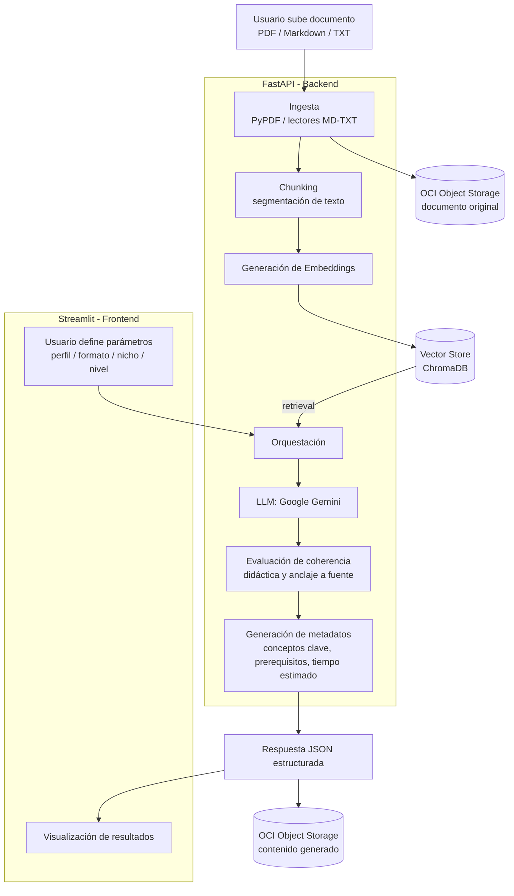

# NM-01 — Arquitectura de la Solución y Contratos de Datos

**Proyecto:** NuevaMente — Sistema Inteligente de Adaptación y Generación de Contenido Educativo
**Ticket:** NM-01 | **Rol:** Architect | **Bloquea a:** NM-03, NM-05, NM-07, NM-12
**Estado:** Propuesta para revisión del equipo (Sprint Planning 21/09)

> Este documento cierra las decisiones técnicas transversales del proyecto y publica el contrato
> que va a consumir todo el resto de los tickets. No incluye implementación de código
> (fuera de alcance de NM-01).

---

## 1. Diagrama de arquitectura (flujo RAG + Agentes)



**Flujo resumido:** ingesta → chunking → embeddings → vector store → recuperación (retrieval) →
orquestación LLM → evaluación de fidelidad → generación de metadatos → persistencia en OCI →
respuesta JSON → visualización en Streamlit.

---

## 2. Decisiones técnicas y justificación

| Decisión | Elección | Justificación |
|---|---|---|
| **LLM** | **Google Gemini** (API, capa gratuita) | Es la referencia trabajada en clase (documentación y ejemplos del programa ya están orientados a Gemini), tiene tier gratuito generoso que evita fricción de costos para un equipo de 9 personas trabajando en paralelo, y buen soporte de structured outputs / function calling para forzar el JSON de salida. Se deja la integración desacoplada (capa `llm_provider`) para poder swapear a Claude/OpenAI sin tocar el resto del pipeline si hace falta. |
| **Vector Store** | **ChromaDB** | Embebido (no requiere levantar infraestructura aparte, corre local o en la misma instancia), integración directa con LangChain, suficiente para el volumen de un MVP de hackathon. FAISS queda como alternativa si el equipo necesita más performance más adelante. |
| **Framework de orquestación** | **LangChain** para el MVP (chains simples de retrieval + prompt + parseo) | Es lo recomendado en el brief, tiene curva de entrada más rápida que LangGraph para un flujo lineal (ingesta→respuesta), y el equipo puede evolucionar a **LangGraph** como diferencial opcional (sistema multi-agente: Investigador RAG / Redactor Pedagógico / Crítico) una vez que el MVP lineal esté estable. |
| **Stack de interfaz** | **FastAPI (backend) + Streamlit (frontend)** | Streamlit ya fue acordado en la demo del martes para la interfaz. Se agrega FastAPI como capa de backend/API REST **para permitir el trabajo en paralelo**: el equipo de frontend puede construir contra el contrato JSON (mockeado) mientras el equipo de backend implementa la pipeline real, sin bloquearse mutuamente. FastAPI además valida los esquemas de entrada/salida con Pydantic, cumpliendo el requisito de "tipado estricto". |
| **Persistencia** | **OCI Object Storage** (obligatorio) | Un bucket Always Free (`nuevamente-contenidos-educativos`) para documentos originales y JSON generados, vía `oci-sdk` para Python. |

---

## 3. Contrato JSON de entrada

```json
{
  "documento_titulo": "string",
  "documento_contenido": "string",
  "perfil_destinatario": "enum",
  "formato_salida": "enum",
  "nicho_sector": "enum",
  "nivel_detalle": "enum"
}
```

### Valores permitidos por campo

| Campo | Tipo | Valores permitidos |
|---|---|---|
| `documento_titulo` | string | Título libre del documento fuente |
| `documento_contenido` | string | Texto extraído del documento (PDF/MD/TXT) |
| `perfil_destinatario` | enum | `"Principiante"` \| `"Desarrollador_Junior_SemiSenior"` \| `"Lider_Tecnico_Arquitecto"` \| `"Gestor_Ejecutivo_No_Tecnico"` |
| `formato_salida` | enum | `"Tutorial"` \| `"Flashcards"` \| `"Quiz"` \| `"Resumen_Ejecutivo"` \| `"Guion_Clase"` |
| `nicho_sector` | enum | `"Fintech"` \| `"Salud"` \| `"Ecommerce"` \| `"General"` |
| `nivel_detalle` | enum | `"Introductorio"` \| `"Didactico"` \| `"Tecnico_Profundo"` |

> Nota: los valores enum se definen en `snake_case` sin espacios ni acentos para que sean estables
> como constantes en código (frontend, backend y validación Pydantic). El texto legible para el
> usuario en la UI de Streamlit puede mapear estos valores a las etiquetas del brief original.

---

## 4. Contrato JSON de salida

```json
{
  "status": "exito | error",
  "metadatos": {
    "perfil_aplicado": "string",
    "formato_generado": "string",
    "tiempo_estimado_estudio_minutos": "number",
    "conceptos_clave": ["string"]
  },
  "contenido_adaptado": {
    "titulo": "string",
    "introduccion_contextualizada": "string",
    "items": []
  },
  "evaluacion_calidad": {
    "anclaje_fuente_score": "number (0-1)",
    "claridad_pedagogica": "Alta | Media | Baja",
    "observaciones": "string"
  },
  "almacenamiento_oci": {
    "bucket": "string",
    "objeto_id": "string",
    "status_upload": "completado | error"
  }
}
```

En caso de `"status": "error"`, se agrega un bloque adicional:

```json
{
  "status": "error",
  "error": {
    "codigo": "string",
    "mensaje": "string"
  }
}
```

---

## 5. Estructura de `contenido_adaptado.items` según `formato_salida`

El array `items` cambia de forma según el formato pedagógico solicitado. Todos los formatos
comparten `contenido_adaptado.titulo` e `introduccion_contextualizada`; lo que varía es el
contenido de cada item.

### Flashcards
```json
{ "frente": "string", "dorso": "string", "pista_didactica": "string" }
```

### Quiz
```json
{
  "pregunta": "string",
  "opciones": ["string", "string", "string", "string"],
  "respuesta_correcta": "string",
  "justificacion": "string"
}
```

### Tutorial (Guía Paso a Paso)
```json
{
  "paso_numero": "number",
  "titulo_paso": "string",
  "contenido": "string",
  "codigo_ejemplo": "string | null"
}
```

### Resumen Ejecutivo (TL;DR)
```json
{
  "punto_clave": "string",
  "descripcion": "string",
  "impacto_negocio": "string"
}
```

### Guion de Clase / Video
```json
{
  "seccion": "string",
  "tiempo_estimado_minutos": "number",
  "narracion": "string",
  "notas_visuales": "string"
}
```

> Recomendación de implementación: modelar cada uno de estos cinco casos como un `schema`
> Pydantic separado (`FlashcardItem`, `QuizItem`, `TutorialItem`, `ResumenItem`, `GuionItem`) con
> un `Union` discriminado por `formato_salida`, para que la validación de tipado estricto se
> mantenga incluso siendo la estructura polimórfica.

---

## 6. Convención de ramas y commits

**Ramas**
- `main` → siempre desplegable/estable.
- `develop` → integración de features antes de pasar a `main`.
- `feature/NM-XX-descripcion-corta` → una rama por ticket (ej. `feature/NM-05-pipeline-rag`).
- `fix/NM-XX-descripcion-corta` → correcciones puntuales.

**Commits (Conventional Commits)**
```
feat(NM-05): implementar pipeline de chunking y embeddings
fix(NM-07): corregir validación de enum en perfil_destinatario
docs(NM-01): publicar contrato JSON y diagrama de arquitectura
chore: actualizar dependencias
```
Prefijos: `feat`, `fix`, `docs`, `chore`, `test`, `refactor`.

**Pull Requests**
- Toda rama `feature/*` o `fix/*` se mergea a `develop` vía PR.
- Mínimo 1 revisión de otro integrante antes de mergear.
- El PR debe referenciar el ticket (ej. `Closes NM-05`).

---

## Próximos pasos derivados de este documento
- [ ] Validar esta propuesta con el equipo en el sprint planning del lunes 21/09.
- [ ] Publicar este archivo en el repo como `docs/ARCHITECTURE.md`.
- [ ] Destrabar NM-03 (estructura del commit inicial) una vez aprobado.
- [ ] Los tickets NM-05, NM-07 y NM-12 pueden asignarse en base a este contrato.
