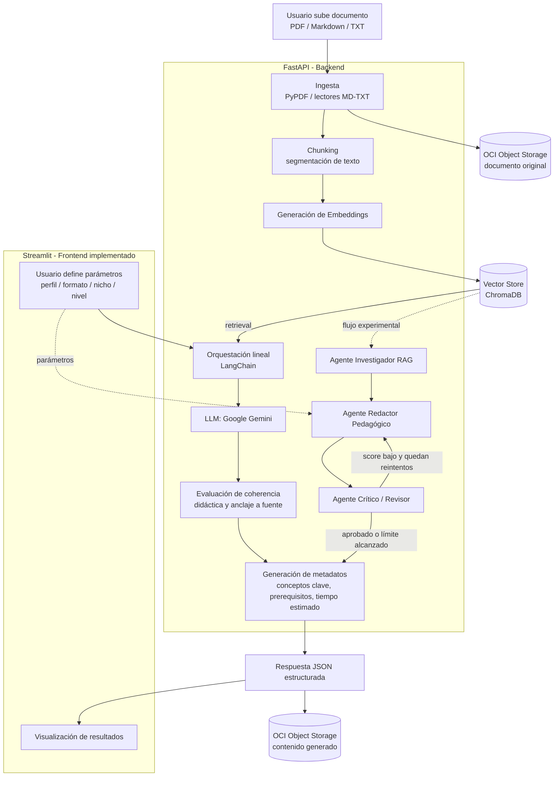

# NM-01 — Arquitectura de la Solución y Contratos de Datos

**Proyecto:** NuevaMente — Sistema Inteligente de Adaptación y Generación de Contenido Educativo
**Ticket:** NM-01 | **Rol:** Architect | **Bloquea a:** NM-03, NM-05, NM-07, NM-12
**Estado:** Arquitectura aprobada e implementada para el MVP de backend

> Este documento registra las decisiones técnicas transversales y el contrato compartido por el
> backend y sus consumidores. Tambien refleja el estado real de implementacion alcanzado por los
> tickets posteriores a NM-01.

---

## 1. Diagrama de arquitectura (flujo RAG + Agentes)


```mermaid
flowchart TD
    A[Usuario sube documento<br/>PDF / Markdown / TXT] --> B[Ingesta<br/>PyPDF / lectores MD-TXT]
    B --> C[Chunking<br/>segmentación de texto]
    C --> D[Generación de Embeddings]
    D --> E[(Vector Store<br/>ChromaDB)]

    F[Usuario define parámetros<br/>perfil / formato / nicho / nivel] --> G[Orquestación lineal<br/>LangChain]
    E -- retrieval --> G
    G --> H[LLM: Google Gemini]
    H --> I[Evaluación de coherencia<br/>didáctica y anclaje a fuente]
    I --> J[Generación de metadatos<br/>conceptos clave, prerequisitos, tiempo estimado]
    J --> K[Respuesta JSON estructurada]

    E -. flujo experimental .-> A1[Agente Investigador RAG]
    F -. parámetros .-> A2[Agente Redactor Pedagógico]
    A1 --> A2
    A2 --> A3[Agente Crítico / Revisor]
    A3 -- score bajo y quedan reintentos --> A2
    A3 -- aprobado o límite alcanzado --> J

    B --> L[(OCI Object Storage<br/>documento original)]
    K --> M[(OCI Object Storage<br/>contenido generado)]

    subgraph Backend [FastAPI - Backend]
        B
        C
        D
        G
        H
        I
        J
        A1
        A2
        A3
    end

    subgraph Frontend [Streamlit - Frontend implementado]
        F
        N[Visualización de resultados]
    end

    K --> N
```

**Flujo resumido:** ingesta → chunking → embeddings → vector store → recuperación (retrieval) →
orquestación LLM → evaluación de fidelidad → generación de metadatos → persistencia en OCI →
respuesta JSON. El flujo multi-agente reutiliza retrieval, generación y evaluación, pero todavía
no está seleccionable desde el endpoint integral. Streamlit está implementado como consumidor de
los endpoints de extracción y adaptación de FastAPI. En OCI Compute, Traefik publica únicamente
la interfaz y FastAPI permanece en una red Docker interna.

---

## 2. Decisiones técnicas y justificación

| Decisión | Elección | Justificación |
|---|---|---|
| **LLM** | **Google Gemini** (API, capa gratuita) | Es la referencia trabajada en clase (documentación y ejemplos del programa ya están orientados a Gemini), tiene tier gratuito generoso que evita fricción de costos para un equipo de 9 personas trabajando en paralelo, y buen soporte de structured outputs / function calling para forzar el JSON de salida. Se deja la integración desacoplada (capa `llm_provider`) para poder swapear a Claude/OpenAI sin tocar el resto del pipeline si hace falta. |
| **Vector Store** | **ChromaDB** | Embebido (no requiere levantar infraestructura aparte, corre local o en la misma instancia), integración directa con LangChain, suficiente para el volumen de un MVP de hackathon. FAISS queda como alternativa si el equipo necesita más performance más adelante. |
| **Framework de orquestación** | **LangChain** para el endpoint del MVP y **LangGraph** para el flujo multi-agente experimental | El pipeline lineal es el recorrido estable de la API. LangGraph implementa Investigador RAG, Redactor Pedagógico y Crítico/Revisor con reintentos limitados; su exposición desde el endpoint queda pendiente. |
| **Stack de interfaz** | **FastAPI (backend) + Streamlit (frontend)** | FastAPI expone la API REST y valida los contratos mediante Pydantic. Streamlit permite cargar documentos, seleccionar los ejes de adaptación y consumir la API sin acoplar lógica de negocio a la interfaz. |
| **Persistencia** | **OCI Object Storage** (obligatorio) | El bucket privado `nuevamente-contenidos-educativos` almacena documentos originales y JSON generados mediante el SDK de OCI para Python. El pipeline real ya utiliza el adaptador de almacenamiento. |
| **Despliegue** | **OCI Compute + Docker Compose + Traefik** | FastAPI y Streamlit se ejecutan como procesos separados. Solo Streamlit queda expuesto; FastAPI utiliza la red interna. La VM accede a Vault y Object Storage mediante Instance Principal. |

---

## 3. Contrato JSON de entrada

```json
{
  "documento_titulo": "string",
  "documento_contenido": "string",
  "perfil_destinatario": "enum",
  "formato_salida": "enum",
  "nicho_sector": "enum",
  "nivel_detalle": "enum"
}
```

### Valores permitidos por campo

| Campo | Tipo | Valores permitidos |
|---|---|---|
| `documento_titulo` | string | Título libre del documento fuente |
| `documento_contenido` | string | Texto extraído del documento (PDF/MD/TXT) |
| `perfil_destinatario` | enum | `"Principiante"` \| `"Desarrollador_Junior_SemiSenior"` \| `"Lider_Tecnico_Arquitecto"` \| `"Gestor_Ejecutivo_No_Tecnico"` |
| `formato_salida` | enum | `"Tutorial"` \| `"Flashcards"` \| `"Quiz"` \| `"Resumen_Ejecutivo"` \| `"Guion_Clase"` |
| `nicho_sector` | enum | `"Fintech"` \| `"Salud"` \| `"Ecommerce"` \| `"General"` |
| `nivel_detalle` | enum | `"Introductorio"` \| `"Didactico"` \| `"Tecnico_Profundo"` |

> Nota: los valores enum usan exactamente los identificadores publicados en este contrato, sin
> espacios ni acentos. El frontend puede mapearlos a etiquetas legibles sin cambiar el valor que
> intercambia con la API.

---

## 4. Contrato JSON de salida

```json
{
  "status": "exito | error",
  "metadatos": {
    "perfil_aplicado": "string",
    "formato_generado": "string",
    "tiempo_estimado_estudio_minutos": "number",
    "conceptos_clave": ["string"],
    "prerrequisitos": ["string"]
  },
  "contenido_adaptado": {
    "titulo": "string",
    "introduccion_contextualizada": "string",
    "items": []
  },
  "evaluacion_calidad": {
    "anclaje_fuente_score": "number (0-1)",
    "claridad_pedagogica": "Alta | Media | Baja",
    "observaciones": "string"
  },
  "almacenamiento_oci": {
    "bucket": "string",
    "objeto_id": "string",
    "status_upload": "completado | error"
  }
}
```

En caso de `"status": "error"`, se agrega un bloque adicional:

```json
{
  "status": "error",
  "error": {
    "codigo": "string",
    "mensaje": "string"
  }
}
```

---

## 5. Estructura de `contenido_adaptado.items` según `formato_salida`

El array `items` cambia de forma según el formato pedagógico solicitado. Todos los formatos
comparten `contenido_adaptado.titulo` e `introduccion_contextualizada`; lo que varía es el
contenido de cada item.

### Flashcards
```json
{ "frente": "string", "dorso": "string", "pista_didactica": "string" }
```

### Quiz
```json
{
  "pregunta": "string",
  "opciones": ["string", "string", "string", "string"],
  "respuesta_correcta": "string",
  "justificacion": "string"
}
```

### Tutorial (Guía Paso a Paso)
```json
{
  "paso_numero": "number",
  "titulo_paso": "string",
  "contenido": "string",
  "codigo_ejemplo": "string | null"
}
```

### Resumen Ejecutivo (TL;DR)
```json
{
  "punto_clave": "string",
  "descripcion": "string",
  "impacto_negocio": "string"
}
```

### Guion de Clase / Video
```json
{
  "seccion": "string",
  "tiempo_estimado_minutos": "number",
  "narracion": "string",
  "notas_visuales": "string"
}
```

> Recomendación de implementación: modelar cada uno de estos cinco casos como un `schema`
> Pydantic separado (`FlashcardItem`, `QuizItem`, `TutorialItem`, `ResumenItem`, `GuionItem`) con
> un `Union` discriminado por `formato_salida`, para que la validación de tipado estricto se
> mantenga incluso siendo la estructura polimórfica.

---

## 6. Convención de ramas y commits

**Ramas**
- `main` → siempre desplegable/estable.
- `develop` → integración de features antes de pasar a `main`.
- `feature/NM-XX-descripcion-corta` → una rama por ticket (ej. `feature/NM-05-pipeline-rag`).
- `fix/NM-XX-descripcion-corta` → correcciones puntuales.

**Commits (Conventional Commits)**
```
feat(NM-05): implementar pipeline de chunking y embeddings
fix(NM-07): corregir validación de enum en perfil_destinatario
docs(NM-01): publicar contrato JSON y diagrama de arquitectura
chore: actualizar dependencias
```
Prefijos: `feat`, `fix`, `docs`, `chore`, `test`, `refactor`.

**Pull Requests**
- Toda rama `feature/*` o `fix/*` se mergea a `develop` vía PR.
- Mínimo 1 revisión de otro integrante antes de mergear.
- El PR debe referenciar el ticket (ej. `Closes NM-05`).

---

## Estado de implementación

- [x] Arquitectura y contratos aprobados por el equipo.
- [x] Backend FastAPI y contratos Pydantic implementados.
- [x] Pipeline RAG lineal con Gemini, evaluación de fidelidad y metadatos implementado.
- [x] Persistencia de documentos y paquetes generados integrada con OCI Object Storage.
- [x] Flujo multi-agente con LangGraph implementado y probado mediante script.
- [ ] Selección del flujo multi-agente desde el endpoint integral.
- [x] Frontend Streamlit conectado al contrato de la API.
- [x] Despliegue completo de FastAPI y Streamlit sobre OCI Compute.
